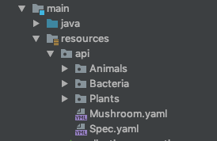

# HungryMoose Docs


## About HungryMoose Docs

HungryMoose Docs is a project that allows for the automatic creation of web-available docs hosted from your application
utilizing the standard HungryMoose scenario structure. Adding a directory tree to your resources folder in a spring boot 
application, specifing the root of the directory tree, and including HungryMoose Docs as a dependency will automatically 
create an endpoint  where your docs can be viewed.

HungryMoose Docs depends on your application being a Spring Boot application.

An example file structure could look like this:



HungryMoose Docs are controlled by the following properties.

| Property Name | Description | Default |
| ----------- | ----------- | --------- |
| `hungrymoose.docs.endpoint` | The rest endpoint that the documentation will be served at. No leading slash. (ie. `hungrymoose.docs.endpoint=documentation`)| `docs` |
| `hungrymoose.docs.root` | The root of the file structure containing all the HungryMoose scenario files. (ie. `hungrymoose.docs.root=api` based on the image above) | `api/` |

Add the following snippet to your `pom.xml` to include the project.

```Maven POM
<dependency>
  <groupId>fordlabs</groupId>
  <artifactId>hungry-moose-docs</artifactId>
  <scope>test</scope>
</dependency>
```

Or if you're using Gradle.

```Gradle
testImplementation 'fordlabs:hungry-moose-docs:1.0-SNAPSHOT'
```

[Back to HungryMoose main page](https://github.com/FordLabs/HungryMoose)
