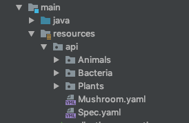

# HungryMoose Test


## About HungryMoose Test

HungryMoose Test is a project that allows for simple, user-flow based API level tests for Spring Boot applications utilizing 
the standard HungryMoose scenario structure. Using the custom test runner, HungryMoose YAML files can be automatically parsed, 
turned into REST calls, and run against your Spring Boot application as a set of JUnit tests.

HungryMooseTest depends on your application being a Spring Boot application and tested with JUnit 4.

An example file structure could look like this:



The following is an example of what a HungryMoose Test file looks like.

```Java
@RunWith(HungryMooseTestRunner.class)
@ApplicationToTest(HungrymoosedemoApplication.class)
@SpecsFromResourcePath("api/spec.yaml")
class HungrymoosedemoApplicationTests {
	// executed by HungryMooseTestRunner
}
```

A HungryMoose Test file is kept in the same directory as your other JUnit tests. The body is empty because the only information
needed to generate and run the tests are available in the annotations. The definitions of the annotations are as follows.

| Annotation | Description | Optional | Default Value |
| ---------- | ----------- | -------- | ------------- |
| `@RunWith` | [@RunWith](https://github.com/junit-team/junit4/wiki/Test-runners#runwith-annotation) property from JUnit 4. Specifies the custom HungryMoose runner that will be used for the tests. | No |
| `@ApplicationToTest` | Takes a class. Used to specify the Spring Boot application that the REST calls will be made against when running the tests. | No |
| `@SpecsFromResourcePath` | Specifies the location of the HungryMoose YAML file used to generate the test cases. Should be a location accessible from the classpath. | No |
| `@ThreadCount` | Takes an integer. Specifies the number of threads to create when running the HungryMoose tests. | Yes | 1 |
| `@JsonComparison` | Takes an Enum value. Used to specify behavior for JSON comparisons utilizing [SkyScreamer's JSONAssert library](http://jsonassert.skyscreamer.org/apidocs/org/skyscreamer/jsonassert/JSONCompareMode.html). Currently only supports `STRICT` and `NON_EXTENSIBLE`.| Yes | `STRICT` |

Add the following snippet to your `pom.xml` to include the project.

```Maven POM
<dependency>
  <groupId>fordlabs</groupId>
  <artifactId>hungry-moose-test</artifactId>
  <scope>test</scope>
</dependency>
```

Or if you're using Gradle.

```Gradle
testImplementation 'fordlabs:hungry-moose-test:1.0-SNAPSHOT'
```

[Back to HungryMoose main page](https://github.com/FordLabs/HungryMoose)
